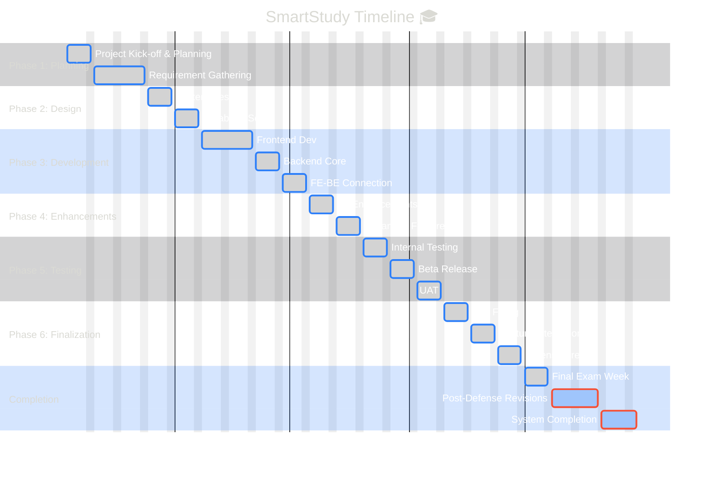

# Project Timeline: SmartStudy Development

### 📅 Implementation Schedule
Below is the structured timeline for the SmartStudy capstone project.

| # | Task Name | Start | End | Days | Phase |
| :--- | :--- | :--- | :--- | :--- | :--- |
| **1** | Project Kick-off & Planning | Aug 4 | Aug 10 | 7d | 🔵 Planning |
| **2** | Requirement Gathering & Refinement | Aug 11 | Aug 24 | 14d | 🔵 Planning |
| **3** | System Design | Aug 25 | Aug 31 | 7d | 🟣 Design |
| **4** | Database Setup (MySQL) | Sep 1 | Sep 7 | 7d | 🟣 Design |
| **5** | Frontend Development (HTML/CSS) | Sep 8 | Sep 21 | 14d | 🟢 Development |
| **6** | Backend Core (PHP) | Sep 22 | Sep 28 | 7d | 🟢 Development |
| **7** | Frontend-Backend Connection | Sep 29 | Oct 5 | 7d | 🟢 Development |
| **8** | JavaScript Enhancements | Oct 6 | Oct 12 | 7d | 🟢 Development |
| **9** | Advanced Features Implementation | Oct 13 | Oct 19 | 7d | 🟢 Development |
| **10** | Internal Testing | Oct 20 | Oct 26 | 7d | 🟠 Testing |
| **11** | Beta Version Release | Oct 27 | Nov 2 | 7d | 🟠 Testing |
| **12** | User Acceptance Testing (UAT) | Nov 3 | Nov 9 | 7d | 🟠 Testing |
| **13** | Bug Fixing & Optimization | Nov 10 | Nov 16 | 7d | 🔴 Deployment |
| **14** | Final Feature Integration | Nov 17 | Nov 23 | 7d | 🔴 Deployment |
| **15** | Final Review & Defense Prep | Nov 24 | Nov 30 | 7d | 🔘 Final |
| **16** | Final Exam Week | Dec 1 | Dec 7 | 7d | 🔘 Final |
| **17** | **Post-Defense Revisions** | Dec 8 | Dec 20 | 12d | 🔵 Planning |
| **18** | **System Completion** | Dec 21 | Dec 30 | 9d | 🔘 Final |

---

#### Phase Legend
*   🔵 **Planning**
*   🟣 **Design**
*   🟢 **Development**
*   🟠 **Testing**
*   🔴 **Deployment**
*   🔘 **Final**

---

### 📊 Timeline Visualization (Mermaid)

